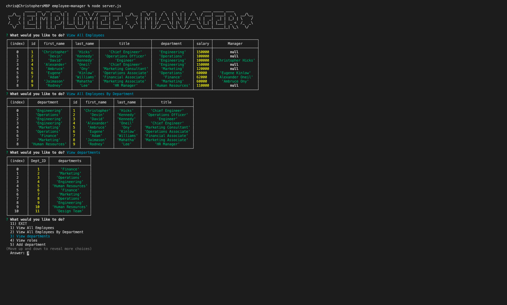

# Employee Manager

# Link to video
[VIEW MY WORK HERE!](https://drive.google.com/file/d/1hTqYDHPsrvvlhqghnTlTMDE-jhpjdIk3/view)

## Table of Contents

* [Description](#Description)
* [Author](#Author)

## Description
 
This application is more of a demonstration for Content Management Systems for tracking employee information at a company. This command line interface makes it easy for non-developers to view and interact with information stored in databases using node, inquirer, MySQL, and console.table, and allows the user to add or update information in those tables. The user for this application is a business owner wanting the ability to view and manage the departments, roles, and employees in the company and make the necessary changes.

## Author

**Christopher Hicks**

- Github: [chris31roc](https://github.com/chris31roc)

- Email: chris31roc@yahoo.com